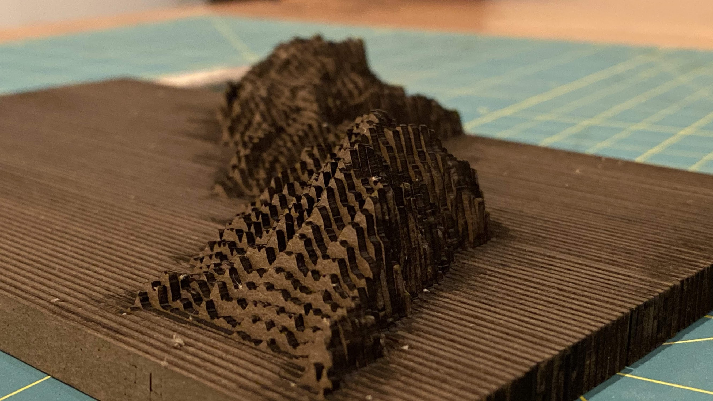

# 🏔laserUp
create 3D relief maps for laser cutting.
See https://github.com/dps/peak-map for a UI to generate the raw input data (hosted here: http://singleton.io/peak-map )



## Usage
```
🚀 python laserup.py --help                                                
usage: laserup.py [-h] -i INFILE -t THICKNESS_MM [-m MAX_HEIGHT_MM] -o OUTFILE
                  [-s START_SLICE] [-c SLICE_COUNT] [-f] [-l]

🏔 Create 3D relief map slices for Glowforge. 🌎Generate input files at
http://singleton.io/peak-map/

optional arguments:
  -h, --help            show this help message and exit
  -i INFILE, --input INFILE
                        read JSON input from FILE
  -t THICKNESS_MM, --material_thickness_mm THICKNESS_MM
                        material thickness in mm
  -m MAX_HEIGHT_MM, --max_height_mm MAX_HEIGHT_MM
                        max design height in mm
  -o OUTFILE, --out OUTFILE
                        Output DIRECTORY and file name BASE. e.g. 'foo' ->
                        writes SVG to files foo/foo_0000.svg, foo/foo_0001.svg
                        etc.
  -s START_SLICE, --start_slice START_SLICE
                        First slice number for this sheet
  -c SLICE_COUNT, --slice_count SLICE_COUNT
                        Number of slices for this sheet
  -f, --force           Delete and overwrite existing output if already exists
  -l, --land_only       Ignore rows in source data containing no land (not
                        recommended if your design has multiple islands)
```

## Example
```
$ python laserup.py -i testdata/catalina.json -t 5 -o first.svg -s 0 -c 28
LandRows: 670 of 1085
Desired slices: 38.036810
Interpolate every: 28
Total slices: 38
Writing 28 slices starting at 0.

$ python laserup.py -i testdata/catalina.json -t 5 -o second.svg -s 28 -c 10 
LandRows: 670 of 1085
Desired slices: 38.036810
Interpolate every: 28
Total slices: 38
Writing 10 slices starting at 28.

```
